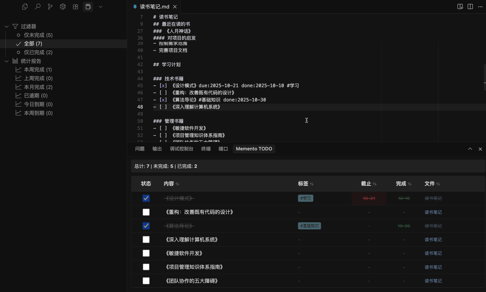

<div align="center">

# 📝 Memento

### 让 Markdown 笔记管理变得优雅而高效

[](https://github.com/wenyg/memento/releases)
[](https://code.visualstudio.com/)
[](./LICENSE)
[](https://marketplace.visualstudio.com/items?itemName=wenyg.memento)

**[🚀 立即安装](#-快速开始)** • **[✨ 功能特性](#-核心功能)** • **[⚙️ 配置](#️-配置说明)** • **[🎯 使用场景](#-使用场景)**

<p align="center">
  <strong>一款专为 Markdown 用户打造的笔记管理神器</strong><br>
  智能标签分类 • 快速日报周报 • 强大 TODO 管理 • 零配置即用
</p>

</div>

---

## 🌟 为什么选择 Memento？

<table>
<tr>
<td width="25%">

### 🎯 极简设计
无需复杂配置，安装即用<br>
专注于写作，不被工具束缚

</td>
<td width="25%">

### ⚡️ 高效管理  
智能标签自动分类<br>
一键创建日报/周报模板

</td>
<td width="25%">

### 📊 可视化展示
直观的树形视图<br>
TODO 进度一目了然

</td>
<td width="25%">

### 🔍 快速访问
最近笔记优先显示<br>
标签层级化分类检索

</td>
</tr>
</table>

---

## 🚀 快速开始

### 从 Marketplace 安装（推荐）

<div align="center">

**在 VS Code 插件中搜索 "Memento" 并点击安装**

或者点击下方按钮直接安装 👇

[](https://marketplace.visualstudio.com/items?itemName=wenyg.memento)

</div>

---

## ✨ 核心功能

### 📋 最近笔记 - 时间线视图


> 自动按时间排序，最新笔记一目了然，支持笔记置顶功能

---

### 🏷️ 智能标签 - 多级分类


> 支持层级标签（如 `#工作/项目/重要`），自动构建标签树，让笔记分类井井有条

---

### 📅 日报周报 - 一键生成


> 预设模板，自动填充日期，工作汇报从未如此轻松

---

### ✅ TODO 管理 - 任务追踪



> 纯 Markdown 语法，支持截止日期、完成日期、标签等扩展属性，任务管理更专业

---

## 🎯 使用场景

<table>
<tr>
<td width="33%" align="center">

### 📚 知识管理

建立个人知识库<br>
用标签组织知识体系

</td>
<td width="33%" align="center">

### 💼 工作汇报

快速生成日报周报<br>
工作内容有条不紊

</td>
<td width="33%" align="center">

### ✏️ 日常记录

记录生活点滴<br>
随时回顾历史笔记

</td>
</tr>
</table>

---

## ⚙️ 配置说明

### 🎛️ 基础配置

<details>
<summary><b>设置笔记根目录</b></summary>

<br>

在 VS Code 设置中配置笔记根目录：

```json
{
  "memento.notesPath": "/Users/yourname/Documents/Notes"
}
```

> 💡 **提示**：未配置时默认使用当前工作区目录

</details>

<details>
<summary><b>自定义日报周报模板</b></summary>

<br>

支持以下模板变量：

| 变量 | 说明 | 示例 |
|------|------|------|
| `{{year}}` | 年份（4位） | 2025 |
| `{{month}}` | 月份（2位） | 11 |
| `{{day}}` | 日期（2位） | 04 |
| `{{week}}` | 周数（2位） | 45 |
| `{{title}}` | 自动生成标题 | 2025年11月4日 |
| `{{date}}` | ISO 格式日期 | 2025-11-04 |

</details>

<details>
<summary><b>标签系统</b></summary>

<br>

支持两种标签方式：

**方式一：正文标签**
```markdown
今天完成了 #项目/前端 的开发工作
```

**方式二：Front Matter**
```yaml
---
title: 我的笔记
date: 2025-11-04
tags: [工作, 项目/重要, 学习]
---
```

> 💡 **提示**：支持多级标签，使用 `/` 分隔层级

</details>

<details>
<summary><b>TODO 扩展语法</b></summary>

<br>

基础语法：
```markdown
- [ ] 待办事项
- [x] 已完成事项
```

扩展属性：
```markdown
- [x] 完成项目报告 due:2025-11-05 done:2025-11-04 #工作/重要
```

| 属性 | 说明 | 格式 |
|------|------|------|
| `due:` | 截止日期 | YYYY-MM-DD |
| `done:` | 完成日期 | YYYY-MM-DD |
| `#标签` | 任务标签 | #标签名 |

</details>

---

## 💬 反馈与支持

<div align="center">

### 喜欢 Memento？

如果这个插件对你有帮助，请给个 ⭐️ Star 支持一下！

[](https://github.com/wenyg/memento)
[](https://github.com/wenyg/memento/issues)

**[🐛 报告问题](https://github.com/wenyg/memento/issues/new)** • **[💡 功能建议](https://github.com/wenyg/memento/issues/new)** • **[📖 查看文档](https://github.com/wenyg/memento)**

</div>

---

<div align="center">

**Made with ❤️ by [wenyg](https://github.com/wenyg)**

[MIT License](./LICENSE) © 2025

</div>