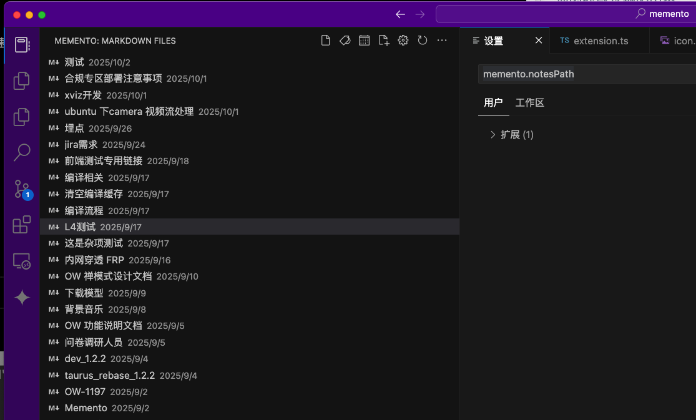
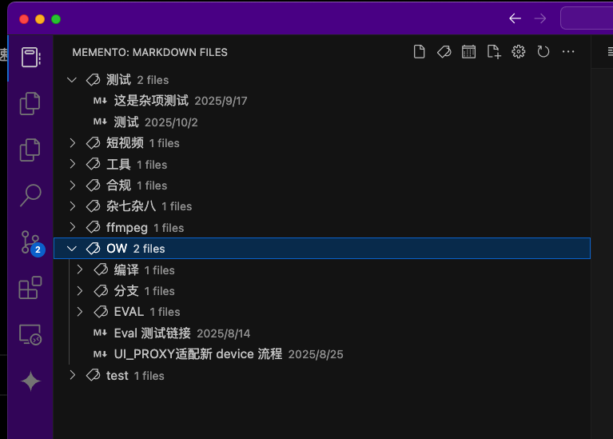
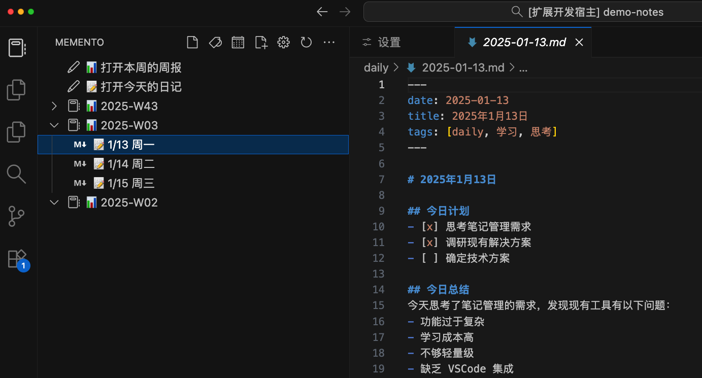
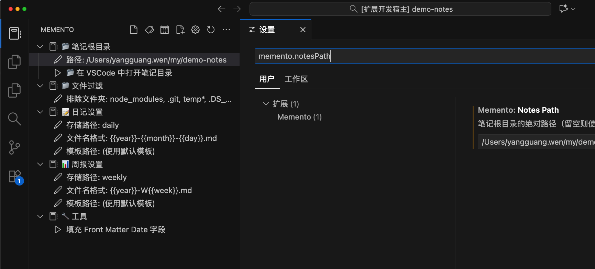

# Memento

轻量级 Markdown 笔记管理插件，让你的笔记井井有条。

## ✨ 核心功能

- **最近笔记** - 按时间排序，快速访问最新笔记

- **标签视图** - 支持多级标签（如 `#工作/项目`），自动分类

  支持两种标签方式：
    - 正文中的 `#标签` 格式
    - Front Matter 中的 `tags` 字段

      ```yaml
      ---
      title: 我的笔记
      date: 2025-01-15
      tags: [工作, 项目/重要]
      ---
      ```
- **日报视图** - 日报、周报一键创建和管理


## 📝 配置说明



### 全局设置（VSCode 设置）
```json
{
  "memento.notesPath": "/Users/yourname/Documents/Notes"
}
```

### 日报模板变量
- `{{year}}` - 年份（4位）
- `{{month}}` - 月份（2位）
- `{{day}}` - 日期（2位）
- `{{week}}` - 周数（2位）
- `{{title}}` - 自动生成标题
- `{{date}}` - ISO 格式日期

## 🤝 反馈与贡献

欢迎提交 Issue 和 PR！

仓库地址：[https://github.com/wenyg/memento](https://github.com/wenyg/memento)