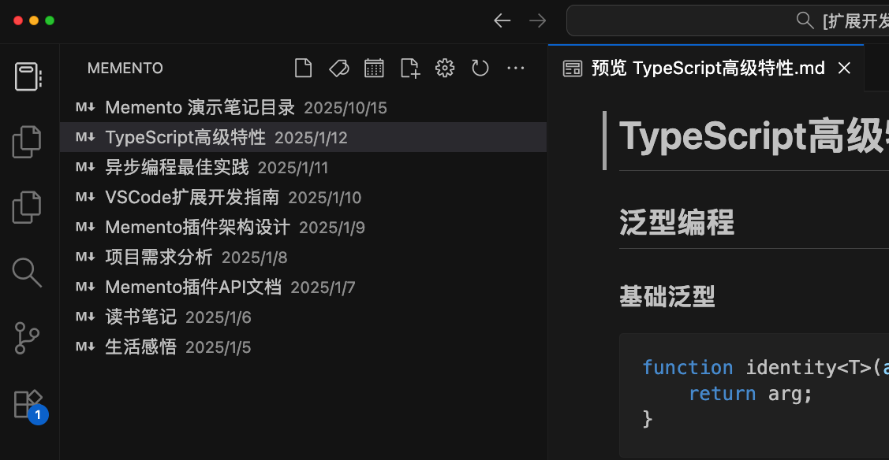

# Memento

轻量级 Markdown 笔记管理插件，让你的笔记井井有条。

## ✨ 核心功能

### 📋 多视图管理
- **最近笔记** - 按时间排序，快速访问最新笔记
- **标签视图** - 支持多级标签（如 `#工作/项目`），自动分类
- **日历视图** - 日记、周报一键创建和管理
- **新建笔记** - 选择文件夹，快速创建新笔记



### 🏷️ 智能标签
支持两种标签方式：
- 正文中的 `#标签` 格式
- Front Matter 中的 `tags` 字段

```yaml
---
title: 我的笔记
date: 2025-01-15
tags: [工作, 项目/重要]
---
```


### 📅 日记周报
- 一键创建今日日记 / 本周周报
- 自定义文件命名格式
- 支持模板系统
- 查看历史记录


### ⚙️ 灵活配置
在设置视图中可视化配置所有选项：
- 笔记根目录设置
- 文件夹过滤规则
- 日记/周报路径和格式
- 模板文件路径


## 🚀 快速开始

### 安装
1. 在 VSCode 扩展市场搜索 **Memento**
2. 点击安装并重启 VSCode
3. 点击侧边栏的 Memento 图标开始使用

### 基础配置
1. 打开设置视图（点击齿轮图标）
2. 展开"笔记根目录"，设置你的笔记目录路径
3. （可选）配置文件过滤、日记周报等选项

### 开始使用
- 点击 📝 新建笔记按钮创建第一个笔记
- 使用 `#标签` 为笔记分类
- 在日历视图中管理日记和周报

## 📝 配置说明

### 全局设置（VSCode 设置）
```json
{
  "memento.notesPath": "/Users/yourname/Documents/Notes"
}
```

### 高级配置（`.memento/config.json`）
在笔记根目录创建此文件进行高级配置：

```json
{
  "excludeFolders": ["node_modules", ".git", "temp*"],
  "dailyNotesPath": "journal/daily",
  "dailyNoteFileNameFormat": "{{year}}-{{month}}-{{day}}.md",
  "dailyNoteTemplatePath": "templates/daily.md"
}
```

### 模板变量
- `{{year}}` - 年份（4位）
- `{{month}}` - 月份（2位）
- `{{day}}` - 日期（2位）
- `{{week}}` - 周数（2位）
- `{{title}}` - 自动生成标题
- `{{date}}` - ISO 格式日期

## 💡 使用技巧

**标签组织**
- 使用 `/` 创建层级：`#项目/重要` → `#项目/进行中`
- 在 Front Matter 中定义标签，正文更简洁

**模板示例**
```markdown
---
title: {{title}}
date: {{date}}
tags: [日记]
---

# {{title}}

## 今日计划
-

## 今日总结
-

```

**批量处理**
- 使用"填充 Front Matter Date 字段"为旧笔记添加日期

## 🔧 常见问题

**Q: 笔记不在工作区，如何搜索？**
A: 在设置中点击"在 VSCode 中打开笔记目录"，会在新窗口打开笔记目录，可使用 VSCode 全部功能。

**Q: 如何排除某些文件夹？**
A: 在设置视图 → 文件过滤中配置，支持通配符（如 `temp*`）。


## 📦 版本历史

### 0.0.1
- ✅ 时间视图、标签视图、日历视图
- ✅ Front Matter 支持
- ✅ 新建笔记功能
- ✅ 日记周报系统
- ✅ 可视化设置界面

## 🤝 反馈与贡献

欢迎提交 Issue 和 PR！

仓库地址：[https://github.com/wenyg/memento](https://github.com/wenyg/memento)

## 📄 许可证

MIT
